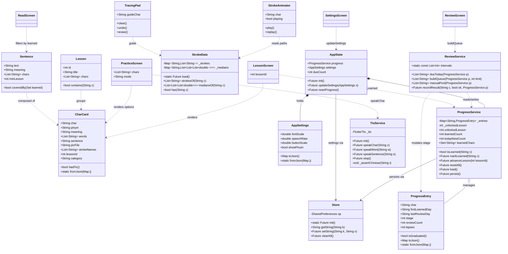
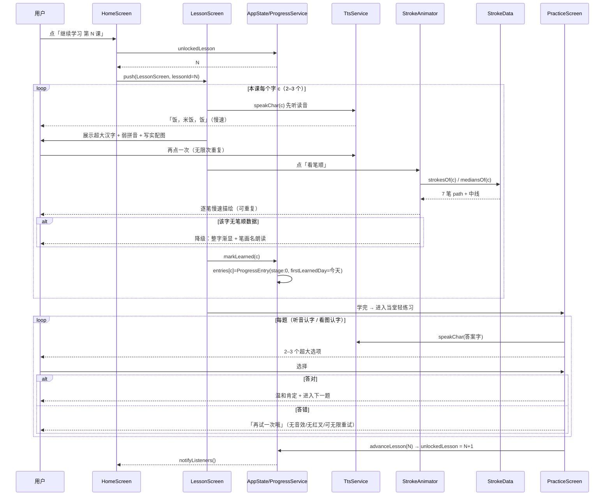
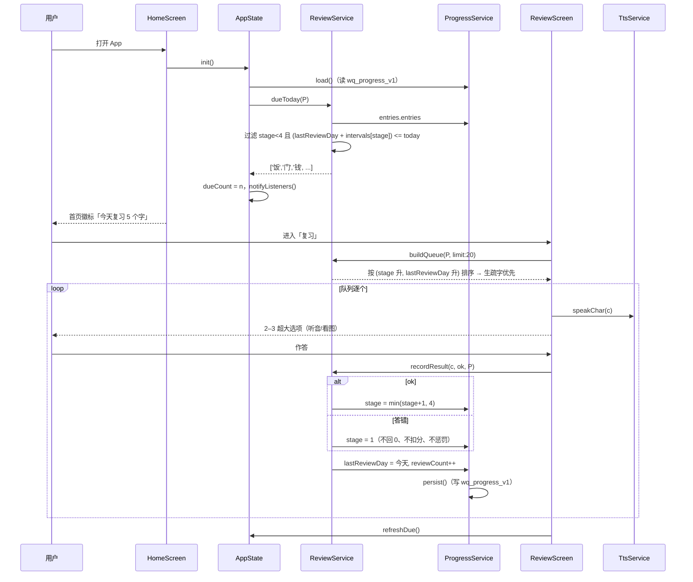
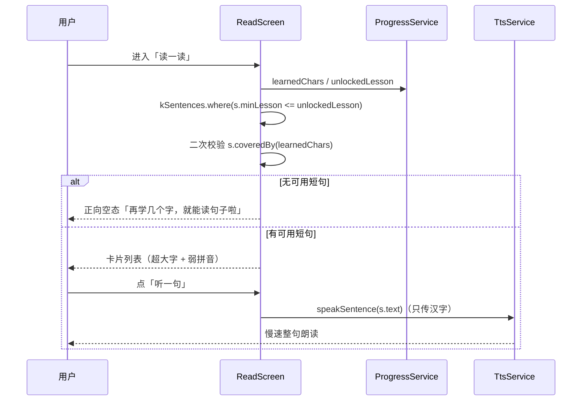
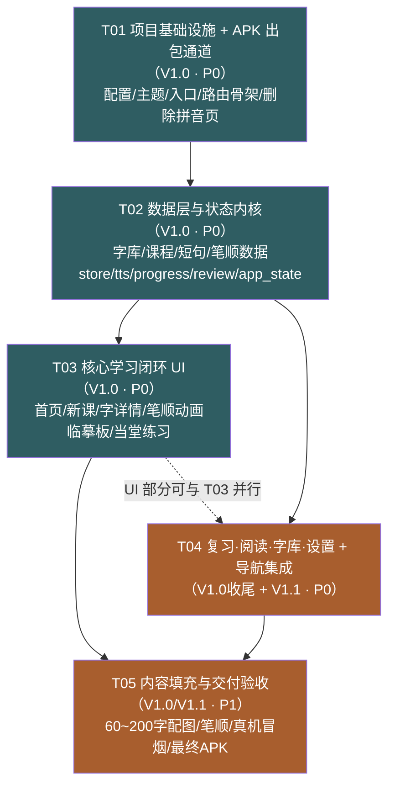

# 晚晴识字 · 架构设计与任务分解

> 版本：v1.0 · 架构师：高见远 · 日期：2026-08-31
> 项目路径：`D:\Progect-3\wanqing_shizi`
> 目标：交付可安装的 `app-release.apk`，纯离线、无网络、无广告。

---

## 0. 环境勘察结论（先看，这些发现改变了方案）

| 项 | 实测结果 | 对方案的影响 |
|---|---|---|
| Flutter SDK | `D:\flutter_sdk\flutter` **3.47.1 / Dart 3.13.1**（stable） | 沿用，不升级 |
| JDK | `JAVA_HOME=D:\jdk\zulu17.68.203-ca-jdk17.0.20.1-win_x64` | 构建前必须显式导出 |
| Android SDK | `D:\android_sdk`（adb 存在） | 同上 |
| Gradle | **真实 `GRADLE_USER_HOME=D:\gradle`**（不是 `~/.gradle`）<br>已缓存 `gradle-9.3.1-all` + **112 个模块** | **离线构建可行**，缓存是热的 |
| 已有产物 | `build/app/outputs/flutter-apk/app-debug.apk` 已构建成功 | 构建链路跑通过，非从零起步 |
| `dl.google.com` | **实测 200**（`.../com/android/tools/build/gradle/8.7.0/...pom`） | 网络并非全断，只是不稳定/易超时 |
| `pub.dev` | **实测 200** | 可以 `pub get`，但不必要 |
| `cdn.jsdelivr.net` | **实测 200**，`hanzi-writer-data@2.0.1/饭.json` 可下载，**2442 字节 / 7 笔** | ✅ **笔顺难题解决**（见 1.3） |
| Gradle 兜底 HOME | 若 shell 未导出 `GRADLE_USER_HOME`，gradle 回退到 `C:\Users\Lenovo\.gradle`，那里**只有 `gradle-9.4.1-bin`**（已完整解压在 `...\dists\gradle-9.4.1-bin\asz580zq2jndnco04mx871vrw\gradle-9.4.1\`，但**无 `.ok` 标记**；另有一个只有 `.part`/`.lck` 的失败残留目录 `arn2x92ynaizyzdaamcbpbhtj`） | ⚠️ **绝不能让构建跑在默认 HOME 上** —— 那里没有 9.3.1，wrapper 会去下载 `services.gradle.org` 然后卡死。见 §5.5 应急方案 |
| pub 依赖现状 | `D:\flutter_pub_cache` 里**只有** `flutter_tts 4.2.5` / `shared_preferences 2.5.5` / `flutter_lints 3.0.2` | 强化"零新增依赖"决策（§6） |
| 权限现状 | `android/app/src/main/AndroidManifest.xml` **当前无** `INTERNET`（仅 `src/debug/` 有） | `tools:node="remove"` 属于**防御性加固**，非必需但建议加 |

**结论**：网络在"小文件、短连接"下可用。因此采取 **「构建期联网抓取 → 打包进 APK → 运行时零请求」** 的资源策略，这完全符合 PRD「所有资源必须内置在 APK 里」的硬约束（禁止的是**运行时**拉 CDN，不是构建期取材）。

**⚠️ 纠错一条**：本机 `distributionUrl=gradle-9.3.1-all.zip` 与 `D:\gradle` 缓存**完全匹配**，因此 **绝对不要修改 `gradle-wrapper.properties`**（早期判断"9.3.1 不在本地、必须改成 9.4.1"是错的）。修了反而会触发 200MB 重新下载。正确解法只有一个：**构建前显式导出 `GRADLE_USER_HOME=D:\gradle`**。

---

## 0.5 决策决议（用户/主理人已拍板 —— 实施以此为准，与上文冲突处以此节为准）

> 记录时间：2026-08-31 · 裁决人：齐活林（team-lead）转达用户意见

| # | 事项 | 决议 | 落地要求 |
|---|---|---|---|
| Q1 | 配图方案 | **AI 生成写实照片** | 首批 60 字；512×512 WebP q80；用户接受 ±20MB 体积。清单见 `docs/image-prompt-list.md` |
| Q2' | APK 形态 | **单 arm64** | `flutter build apk --release --target-platform android-arm64` |
| Q3' | 首课难度 | 按架构默认 | 第 1 课 = 我 / 你 / 好，学完即可组成"你好""我好" |
| Q4 | 信仰/佛教词库 | **不做** | ⚠️ 见下方「平民化红线」 |
| Q5 | App 图标 | 换，宣纸米底 + 墨字"晚" | 排 V1.0 收尾（T05） |
| Q6 | 一课几字 | **3 字 × 20 课**（V1.0 = 60 字） | V1.1 扩到 40 课 120 字，见 `docs/char-library-extended.md` |
| Q7 | 旧节气/成语/词条数据 | 随 `content.dart` 归档到 `docs/legacy/` | 不迁入新字库 |
| Q8 | 拼音显隐 | 设置里给开关，**标签写「注音」，不写「拼音」** | 默认开启 |
| Q9 | 内容续航 | V1.0 先出 60 字，**并行扩到 126 字（42 课）** | 数据结构不变，仅加数据 |
| Q10 | 签名 | **正式 keystore 必须配在 T01** | 见下方警告 |
| ⚠️ | **hanzi-writer-data 许可（原 Q2）** | **尚未得到答复** | **阻塞 `docs/stroke-fetch-plan.md` 的执行**。见下方 |

### ⚠️ 待补答复：hanzi-writer-data 的 Arphic PL 许可（原 Q2）

上表 Q2' 是 APK 形态，但**原 Q2「笔顺数据是否采用 hanzi-writer-data」还没有答复**。该数据派生自文鼎（Arphic PL）字体：允许免费使用与再分发，禁止单独出售字数据本身。本项目为自用非商业、随 APK 整体分发，属于许可范围。

- **若接受** → 按 `docs/stroke-fetch-plan.md` 执行，得到真正的逐笔笔顺动画。
- **若不接受** → 走 S2 降级：整字描红 + 笔画名序列 + 分步引导（`StrokeAnimator` 组件接口不变，只是数据为空时自动降级）。

**建议接受**。`docs/stroke-fetch-plan.md` 已按"接受"设计，同时把降级路径一并写死，随时可切换。

### ⚠️ 平民化红线（重要纠正，覆盖此前所有相关表述）

用户澄清：**母亲并不是信佛**，只是国内很传统的民间习俗（烧香、敬神）而已，不必当侧重点。此前"母亲信佛"是误解，已从长期记忆修正。

- 字库**纯按生活刚需编排**。V1.0 与扩展字表均**不含** 佛 / 香 / 仙 / 神 / 菩萨 / 经 / 念 等宗教神仙类字。
- 配图**禁止出现宗教元素**（香炉、佛像、供桌、护身符、卦象、庙宇）。`火` 配灶火，**不配香烛**。
- 例句、短句、UI 文案一律平民化，不出现"菩萨保佑""烧香拜佛"之类表达。
- 此红线同时约束 `docs/image-prompt-list.md` 与 `docs/char-library-extended.md`。

### ⚠️ 签名警告（Q10，必须在 T01 完成）

一旦平板上装的是 **debug 签名**版，将来换正式签名会直接 `INSTALL_FAILED_UPDATE_INCOMPATIBLE` —— **无法覆盖升级，必须卸载重装 → 进度归零**，正是 Q10 想避免的结局。所以正式 keystore **必须在 T01 就配好**，不能拖到 V1.1。

keystore 生成一次后**必须备份到项目外**（丢了同样无法覆盖升级）：
```bat
keytool -genkey -v -keystore D:\keystore\wanqing.jks -keyalg RSA -keysize 2048 -validity 10000 -alias wanqing
```
随后在 `android/app/build.gradle.kts` 配 `signingConfigs`，并**把密码写进 `android/key.properties`（加入 .gitignore，不入库）**。

---

## 1. 实现方案与框架选型

### 1.1 总体技术选型

| 维度 | 决策 | 理由 |
|---|---|---|
| 框架 | Flutter 3.47.1（沿用现有） | 已装好、已构建通过；升级 = 重新下载引擎 = 高风险 |
| 语言 | Dart 3.13.1，开启 `dart 3` 语法（records / patterns 已在用） | — |
| **状态管理** | **`ChangeNotifier` 单例 + 内置 `ListenableBuilder`** | ⚠️ **不引入任何新包**。理由：① 应用只有 5 个页面、1 份进度、1 份设置，Provider/Riverpod/Bloc 都是过度设计；② 每加一个包就要 `flutter pub get` 联网，是构建期最大不确定性；③ `ListenableBuilder` 是 Flutter 内置 widget，零成本 |
| 路由 | 命名路由 + 集中的 `AppRouter` 表 | 页面少；避免 go_router 依赖 |
| 持久化 | `shared_preferences`（已在 pubspec） | 数据量极小（几百字的 JSON），无需 SQLite |
| 语音 | `flutter_tts`（已在 pubspec）走系统 TTS | PRD 指定 |
| 图形 | 自绘 `CustomPainter` + 极小 SVG-path 解析器 | 见 1.3 / 1.4，**避免引入 `flutter_svg`** |
| 架构模式 | 分层：**data（静态）→ services（能力）→ state（可观察状态）→ screens/widgets（UI）** | UI 不直接碰 SharedPreferences |

### 1.2 三大核心难点与对策

#### 难点 1：纯离线 + 构建期资源获取
- **对策**：所有外部素材在**开发机**上一次性抓取，产物落到 `assets/`，由 `pubspec.yaml` 的 `flutter.assets` 打包进 APK。运行时只用 `rootBundle`，**代码里禁止出现 `http`、`Image.network`、`NetworkImage`**（列为评审红线）。
- **合规加固**：在 `AndroidManifest.xml` 主清单加 `tools:node="remove"` 主动删除 `INTERNET` 权限，用系统机制证明"不可能联网"。

#### 难点 2：笔顺动画（原以为是死结，实测可解）
PRD 禁止运行时拉 `hanzi-writer-data`。但实测 `cdn.jsdelivr.net/npm/hanzi-writer-data@2.0.1/<字>.json` 返回 200。

- **对策**：写一次性抓取脚本 `tools/fetch_strokes.ps1`，按字库清单批量下载，**合并压缩为单个 `assets/strokes.json`**：
  ```json
  { "饭": { "s": ["M 259 579 Q ... Z", "..."], "m": [[[x,y],[x,y]], ...] } }
  ```
  - `s` = 每笔轮廓 SVG path（1024×1024 网格，y 轴向下需翻转）
  - `m` = 每笔中线点列（`medians`，用于"笔尖沿中线行走"的书写动画）
- **体积实测**：单字 1.5–3 KB；压缩为单 JSON（去掉空白、坐标取整）后 **200 字 ≈ 300–450 KB**，APK 增量可忽略。
- **渲染**：`lib/widgets/stroke_animator.dart` 内实现 **约 90 行的 SVG-path 子集解析器**（只支持 `M / L / Q / C / Z` 五种命令，hanzi-writer 数据只用这几种），转成 `dart:ui.Path`，用 `PathMeasure` 做逐笔描绘动画。**零新依赖**。
- **降级**：某字抓取失败 → 该字隐藏"看笔顺"按钮，改为"整字描红 + 笔画名称朗读"，**绝不显示空白或报错**。
- ⚠️ **合规提示**（需用户知晓）：hanzi-writer-data 派生自文鼎（Arphic PL）字体，适用 Arphic Public License —— 允许免费使用与再分发，**禁止单独出售字数据本身**。本项目为自用非商业、且随 APK 整体分发，属于许可范围内。若用户介意，退路是"整字描红 + 笔画名"降级方案（见待明确事项 Q2）。

#### 难点 3：配图（写实、拒绝卡通、体积可控）—— **最终决策**

| 方案 | 体积（200 字） | 风格 | 产出成本 | 结论 |
|---|---|---|---|---|
| A. 打包实景照片 | 依赖素材来源 | ✅ 真实 | ❌ 无版权图源 | 不可行（无图源） |
| B. 手绘 SVG 白描线稿 | ~200 KB | ✅ 写实、克制 | ❌ 200 张手工绘制 | 备选 |
| C. 大号 Emoji | 0 | ❌ **卡通幼稚** | ✅ 零 | ❌ **违反硬要求，淘汰** |
| **D. AI 生成写实照片** | **WebP 512px q80 ≈ 40 KB/张 → 200 字 ≈ 8 MB** | ✅ 真实、可控 | 中（可批量） | ✅ **推荐** |

**最终方案：D 为主 + 文字卡兜底，分批落地**
1. **V1.0 首批 60 字**：生成 60 张 512×512 WebP 写实照片（→ 约 **+2.5 MB**）。风格提示词统一为「真实生活摄影、自然光、干净背景、无文字、无人物脸部、无卡通」；示例：饭=一碗白米饭、门=一扇农家/楼房家门、水=一杯清水、钱=几张人民币平铺。
2. **V1.1 补齐至 200 字**：累计约 +8 MB，可接受（平板存储空间充裕）。
3. **未配图字的兜底**：**不显示图片位、不用 Emoji 顶替**，改为三行文字卡：`实物词（如"一碗米饭"）` + `一句话释义` + `生活例句`。同样达成"理解字义"目标，且视觉零噪音。
4. 图片统一放 `assets/images/chars/<字>.webp`；`CharCard.pic` 只存文件名，无图时为 `null`。

### 1.3 学习闭环的技术映射

`新课学习 → 当堂轻练习 → 系统智能复习 → 短句实战运用`

- **解锁**：`progress.unlockedLesson`（已解锁课号）。学完第 N 课并做完当堂练习 → `unlockedLesson = N+1`。**课程表按顺序，不可跳学**；已学内容可自由回看。
- **当堂练习**：学完一课立刻进入 `PracticeScreen`，题型 2 类（听音认字 / 看图认字），**无倒计时、无分数、无错题惩罚**，选错只弹温和提示 `再试一次哦`，可无限重试，**不锁进度**。
- **智能复习**：`ReviewService` 按 **1/3/7/30 天**四档调度（PRD 要求 1/3/7，第 4 档 30 天用于"熟字减频"）。
- **短句运用**：`Sentence.minLesson = 组成字中最大课号`；运行时双重校验（`minLesson <= unlockedLesson` **且** 每字都在已学集合内），**保证 100% 不出现生字**。

### 1.4 中老年适配的具体量化

- 触控热区最小 **64×64dp**，主按钮高 **72dp**，圆角 16
- 字号档位：小 1.0 / 中 1.15 / **大 1.3（默认）** / 超大 1.5，通过 `AppDimens.scale` 全局乘
- 主汉字在平板上 ≥ **180dp**，占卡片视觉中心 40% 以上
- 语速默认 **0.3**（`setSpeechRate(0.3)`），可调 0.25 / 0.3 / 0.4
- 所有反馈语正向化：无 ✗、无红色错误态、无提示音惩罚

---

## 2. 完整文件清单

图例：🆕 新建 · 🔧 改造 · ❌ 删除 · 📦 构建期生成

### 2.1 Dart 源码

| 路径 | 状态 | 职责 |
|---|---|---|
| `lib/main.dart` | 🔧 | 入口：`ensureInitialized` → `AppState.init()` → `TtsService.init()` → `runApp`；设置竖屏优先 + 横屏可切 |
| `lib/app_router.dart` | 🆕 | 集中路由表 + 路由常量，页面间参数用 `arguments` 传递 |
| `lib/theme/app_theme.dart` | 🔧 | 颜色体系（宣纸米/墨/黛青/赭石/朱印）+ 衬线中文字体回退链；**新增**对比度与暗色规避 |
| `lib/theme/app_dimens.dart` | 🆕 | 尺寸常量：触控热区、按钮高度、字号档位、间距；提供 `AppDimens.of(context)` |
| `lib/data/char_card.dart` | 🆕 | 数据模型：`CharCard` / `Lesson` / `Sentence`（含 `fromJson`） |
| `lib/data/char_library.dart` | 🆕 | **字库本体**：`kCharLibrary: Map<String, CharCard>`，V1.0 首批 60 字，V1.1 扩至 200 |
| `lib/data/lessons.dart` | 🆕 | **课程表**：`kLessons: List<Lesson>`，20 课 × 3 字（V1.0），顺序即解锁顺序 |
| `lib/data/sentences.dart` | 🆕 | **生活短句库**：`kSentences: List<Sentence>`，每条标注 `minLesson` |
| `lib/data/stroke_data.dart` | 🆕 | 笔顺数据加载器：`rootBundle` 读 `assets/strokes.json`，懒加载 + 内存缓存 |
| `lib/services/store.dart` | 🔧 | **重写**：SharedPreferences 底层封装（v1 版本化 key），只做读写，不含业务 |
| `lib/services/tts_service.dart` | 🔧 | **重写**：只接受汉字；`speakChar` / `speakWord` / `speakSentence`；**编译期即禁止拼音入参**（见共享知识） |
| `lib/services/progress_service.dart` | 🆕 | 学习进度：标记已学、解锁推进、已学集合、学会计数、今日新学、重置 |
| `lib/services/review_service.dart` | 🆕 | 1/3/7/30 遗忘曲线调度：到期队列、生疏优先排序、复习结果回写、复习专区手动池 |
| `lib/state/app_state.dart` | 🆕 | `ChangeNotifier` 全局状态：进度 + 设置 + 到期数；UI 通过 `ListenableBuilder` 订阅 |
| `lib/widgets/big_button.dart` | 🆕 | 超大主按钮（高 72dp，热区 64dp，图标+文字，选中/禁用态） |
| `lib/widgets/gentle_hint.dart` | 🆕 | 温和提示（"再试一次哦"），统一正向反馈，**无红色、无 ✗、无音效** |
| `lib/widgets/pinyin_label.dart` | 🆕 | 弱化拼音标注：字号 ≤ 主字 1/4、低对比色、**不可点击、无 TTS** |
| `lib/widgets/char_hero.dart` | 🆕 | 超大汉字展示卡（米字格底 + 主字 + 拼音标注） |
| `lib/widgets/char_image.dart` | 🆕 | 配图组件：有图显示 WebP，无图显示"实物词 + 释义"文字卡兜底 |
| `lib/widgets/stroke_animator.dart` | 🆕 | **笔顺动画**：SVG-path 子集解析器（M/L/Q/C/Z）+ `PathMeasure` 逐笔描绘，慢速可重复；数据缺失时自动降级为整字渐显 |
| `lib/widgets/tracing_pad.dart` | 🔧 | 由 `handwriting_pad.dart` 重命名改造：田字格 + 半透明范字描红 + 清空/撤销/橡皮大按钮；**删除所有评分/判定/对错逻辑** |
| `lib/widgets/option_grid.dart` | 🆕 | 练习选项网格：2–3 个超大汉字/图片选项，无倒计时 |
| `lib/widgets/app_bottom_nav.dart` | 🔧 | **删除"拼音"入口**；改为 5 项：首页 / 学习 / 练习 / 复习 / 我的 |
| `lib/screens/home_screen.dart` | 🔧 | 首页：今天学什么（继续上次）+ 今日待复习 + 累计学会字数 + 大字入口 |
| `lib/screens/lesson_screen.dart` | 🆕 | **新课学习**：一课 2–3 字，逐字卡片 → 学完进当堂练习 |
| `lib/screens/char_detail_screen.dart` | 🔧 | 单字详情，固定 5 项：① 超大汉字 ② 弱拼音 ③ 语音播报 ④ 配图释义 ⑤ 笔顺动画；底部通栏"手写临摹" |
| `lib/screens/practice_screen.dart` | 🆕 | 当堂轻练习：听音认字 / 看图认字，无倒计时无分数 |
| `lib/screens/review_screen.dart` | 🔧 | 智能复习：到期队列 + 复习专区（手动选任意已学字复盘） |
| `lib/screens/read_screen.dart` | 🔧 | 短句运用：只显示 100% 已学字组成的短句，一键整句朗读 |
| `lib/screens/hanzi_screen.dart` | 🔧 | 改造为「**我的字库**」：已学 / 未学分栏，已学可自由回看，**未学不可进入学习（不可跳学）** |
| `lib/screens/settings_screen.dart` | 🆕 | 极简设置：字号 4 档、语速 3 档、按钮大小、一键重置进度（二次确认） |

### 2.2 删除与归档

| 路径 | 处理 | 说明 |
|---|---|---|
| `lib/screens/pinyin_screen.dart` | ❌ **删除** | 独立拼音课程，PRD 彻底舍弃 |
| `lib/screens/pinyin_detail_screen.dart` | ❌ **删除** | 声母韵母专项，PRD 彻底舍弃 |
| `lib/screens/term_detail_screen.dart` | ❌ **删除** | 词条/成语/节气详情页，超出 V1 范围；数据不迁入新字库，留作 V1.3「信仰习俗词库」候选 |
| `lib/data/content.dart` | ❌ **删除**（先归档） | 拼音/词条/故事整体下架；其中**有效的单字字义**迁入 `char_library.dart` |
| `docs/legacy/content_legacy.dart.txt` | 🆕 归档 | `content.dart` 原文备份（含 24 节气、成语、佛教习俗词库，未来可复用） |
| `docs/legacy/方案-晚晴识字-成人汉字拼音学习平板应用.md` | 📁 移入 | 旧方案已被本 PRD 取代，但保留历史决策链 |
| `prototype-晚晴识字.html`（根目录） | 📁 移入 `docs/legacy/` | **建议保留**：唯一的可视化原型，UI 细节（配色、字号、排版）仍可直接参考；移入 docs 保持根目录整洁 |

### 2.3 资源与构建配置

| 路径 | 状态 | 职责 |
|---|---|---|
| `assets/strokes.json` | 📦 构建期生成 | 合并后的笔顺数据（`tools/fetch_strokes.ps1` 产出），200 字 ≈ 300–450 KB |
| `assets/images/chars/<字>.webp` | 📦 构建期生成 | 写实配图，512×512 WebP q80，V1.0 首批 60 张 |
| `tools/fetch_strokes.ps1` | 🆕 | 一次性抓取 hanzi-writer-data 并合并压缩为 `assets/strokes.json` |
| `lib/utils/unicode_name.dart` | 🆕 | 汉字 ↔ 资源文件名的**唯一**转换函数 `assetNameOf(char)`（见 §7.5 命名约定），抓取脚本与运行时共用同一套命名 |
| `pubspec.yaml` | 🔧 | 版本号、`flutter.assets` 声明（strokes.json + images/chars/）、description |
| `android/app/build.gradle.kts` | 🔧 | `applicationId=com.wanqing.shizi`、`minSdk=26`、release 签名、ABI 过滤 |
| `android/app/src/main/AndroidManifest.xml` | 🔧 | `android:label=晚晴识字`、**`tools:node="remove"` 删除 INTERNET 权限** |
| `android/gradle.properties` | 🔧 | 新增超时与离线相关参数（见 5.5） |
| `docs/BUILD.md` | 🆕 | 构建与出包操作手册（命令、产物路径、离线回退、常见坑） |
| `docs/ARCHITECTURE.md` | 🆕 | 本文档 |

---

## 3. 数据结构与接口

### 3.1 类图



### 3.2 Dart 骨架

```dart
// lib/data/char_card.dart
class CharCard {
  final String char;              // '饭'
  final String pinyin;            // 'fàn' —— 仅展示，永不送 TTS
  final String meaning;           // '煮熟的谷类食物'
  final List<String> words;       // ['米饭','吃饭'] —— TTS 只念这个（真实汉字）
  final String sentence;          // '我吃饭了。'
  final String? picFile;          // 'fan.webp'，null = 无图（走文字卡兜底）
  final List<String> strokeNames; // ['撇','横撇','竖提',...] 笔画名称
  final int lessonId;             // 所属课号（1 起）
  final String category;          // '生活起居'
  const CharCard({...});
  bool get hasPic => picFile != null && picFile!.isNotEmpty;
  factory CharCard.fromJson(Map<String, dynamic> j) => ...;
}

class Lesson {
  final int id;              // 1 起，顺序即解锁顺序
  final String title;        // '第 1 课 · 我你 好'
  final List<String> chars;  // 2–3 个字
  const Lesson({...});
}

class Sentence {
  final String text;         // '我吃饭'
  final String meaning;      // 整句意思（可选展示）
  final List<String> chars;  // ['我','吃','饭']
  final int minLesson;       // = chars 中最大 lessonId，运行时再校验一次
  bool coveredBy(Set<String> learned) => chars.every(learned.contains);
}

// lib/services/progress_service.dart
class ProgressEntry {
  final String char;
  final String firstLearnedDay; // 'yyyy-MM-dd'
  final String lastReviewDay;   // 'yyyy-MM-dd'
  final int stage;              // 0=当天新学 1/2/3/4 => +1/+3/+7/+30 天
  final int reviewCount;
  final int lapses;             // 复习中答错次数（只用于降 stage，不展示给用户）
  bool get isGraduated => stage >= 4;
}

// lib/services/review_service.dart
abstract class ReviewService {
  static const List<int> intervals = [1, 3, 7, 30]; // 对应 stage 0..3 的到期间隔

  /// 今天该复习的字：stage<4 且 (lastReviewDay + intervals[stage]) <= today
  static List<String> dueToday(ProgressService p);

  /// 排序：stage 升序（越生疏越前）→ lastReviewDay 升序（越久越前）→ 限 20 个
  static List<String> buildQueue(ProgressService p, {int limit = 20});

  /// 复习专区：全部已学字（含已毕业熟字），供手动复盘
  static List<String> manualPool(ProgressService p);

  /// 答对 → stage+1（封顶 4）；答错 → stage 回 1（不回 0，不惩罚，不扣分）
  static Future<void> recordResult(String c, bool ok, ProgressService p);
}

// lib/state/app_state.dart
class AppState extends ChangeNotifier {
  static final AppState instance = AppState._();
  late final ProgressService progress;
  late AppSettings settings;
  int dueCount = 0;

  Future<void> init() async {
    await Store.init();
    await StrokeData.load();
    progress = ProgressService()..load();
    settings = AppSettings.load();
    refreshDue();
  }
  void refreshDue() { dueCount = ReviewService.dueToday(progress).length; notifyListeners(); }
  Future<void> updateSettings(AppSettings s) async { settings = s; await s.save(); notifyListeners(); }
  Future<void> resetProgress() async { await progress.resetAll(); refreshDue(); }
}
```

### 3.3 存储约定（SharedPreferences）

| Key | 值 | 说明 |
|---|---|---|
| `wq_progress_v1` | JSON `{"unlockedLesson":3,"entries":{"饭":{...}}}` | 版本化 key，便于重置/迁移 |
| `wq_settings_v1` | JSON `{"fontScale":1.3,"speechRate":0.3,...}` | 同上 |
| `wq_day_v1` | JSON `{"lastDay":"2026-08-31","streak":5,"todayNew":2}` | 连续天数、今日新学 |

- 日期**一律存 `yyyy-MM-dd` 本地日期字符串**，不存 `DateTime`（避免时区/序列化歧义）。
- 重置进度 = 删除 `wq_progress_v1` + `wq_day_v1`，**保留设置**。

---

## 4. 程序调用流程

### 4.1 新课学习（含当堂练习）



### 4.2 智能复习调度



### 4.3 短句阅读（100% 已学字保证）



---

## 5. 任务列表

> 依赖顺序执行。**T01 必须第一个做**（先把 APK 出包通道打通，避免最后才发现打不出包）。

### T01 · 项目基础设施与 APK 出包通道（V1.0 · P0）

**依赖**：无
**目标**：改造配置 + 入口骨架，**验证能产出 `app-release.apk`**（哪怕内容为空壳）。这是交付的关键路径，必须先跑通。

**文件**
- 🔧 `pubspec.yaml`（version `1.0.0+1`、description、`flutter.assets` 声明）
- 🔧 `android/app/build.gradle.kts`（`applicationId=com.wanqing.shizi`、`minSdk=26`、release 签名沿用 debug、`abiFilters`）
- 🔧 `android/app/src/main/AndroidManifest.xml`（`android:label=晚晴识字`、`tools:node="remove"` 删 INTERNET）
- 🔧 `android/gradle.properties`（超时/离线参数，见 5.5）
- 🔧 `lib/main.dart`（初始化顺序、竖屏优先 + 横屏可切）
- 🆕 `lib/app_router.dart`（路由表骨架，先挂占位页）
- 🔧 `lib/theme/app_theme.dart`、🆕 `lib/theme/app_dimens.dart`
- 🆕 `lib/widgets/big_button.dart`、🆕 `lib/widgets/gentle_hint.dart`
- 🆕 `docs/BUILD.md`
- ❌ 删除 `lib/screens/pinyin_screen.dart`、`lib/screens/pinyin_detail_screen.dart`、`lib/screens/term_detail_screen.dart`
- 📁 归档 `lib/data/content.dart` → `docs/legacy/content_legacy.dart.txt`；根目录 `prototype-晚晴识字.html` 与旧方案 md → `docs/legacy/`

**验收**：`flutter build apk --release --target-platform android-arm64` 成功，产出 `build/app/outputs/flutter-apk/app-release.apk`；安装到平板后能看到空壳首页；**反编译或用 `aapt dump permissions` 确认无 INTERNET 权限**。

---

### T02 · 数据层与状态内核（V1.0 · P0）

**依赖**：T01
**目标**：把"内容 + 进度 + 复习调度 + 语音"全部做成可被 UI 直接消费的能力。

**文件**
- 🆕 `lib/data/char_card.dart`（CharCard / Lesson / Sentence）
- 🆕 `lib/data/char_library.dart`（V1.0 首批 60 字，含拼音/释义/常用词/例句/笔画名/分类）
- 🆕 `lib/data/lessons.dart`（20 课 × 3 字）
- 🆕 `lib/data/sentences.dart`（生活短句 + `minLesson`）
- 🆕 `lib/data/stroke_data.dart` + 📦 `assets/strokes.json` + 🆕 `tools/fetch_strokes.ps1`
- 🔧 `lib/services/store.dart`（v1 版本化 key 封装）
- 🔧 `lib/services/tts_service.dart`（只说汉字，慢速，**禁拼音**）
- 🆕 `lib/services/progress_service.dart`
- 🆕 `lib/services/review_service.dart`
- 🆕 `lib/state/app_state.dart`

**验收**：`flutter test` 或一段 `main` 冒烟脚本能验证 —— 学完第 1 课后 `unlockedLesson==2`；`ReviewService.dueToday` 在把 `lastReviewDay` 改成 3 天前时返回该字；`kSentences` 中**任意一条** `minLesson <= 1` 的句子，**其每个字都在第 1 课的 3 个字内**（自动校验脚本，防内容返工）。

---

### T03 · 核心学习闭环 UI（V1.0 必做 · P0）

**依赖**：T02
**目标**：PRD 模块 1/2/3 落地 —— 汉字卡片学习、手写临摹、当堂练习。

**文件**
- 🔧 `lib/screens/home_screen.dart`
- 🆕 `lib/screens/lesson_screen.dart`
- 🔧 `lib/screens/char_detail_screen.dart`（固定 5 项内容）
- 🆕 `lib/screens/practice_screen.dart`
- 🆕 `lib/widgets/char_hero.dart`
- 🆕 `lib/widgets/pinyin_label.dart`
- 🆕 `lib/widgets/char_image.dart`（含无图文字卡兜底）
- 🆕 `lib/widgets/stroke_animator.dart`（SVG 子集解析 + 逐笔动画 + 降级）
- 🔧 `lib/widgets/tracing_pad.dart`（由 `handwriting_pad.dart` 重命名改造，**删除全部评分逻辑**）
- 🆕 `lib/widgets/option_grid.dart`

**验收**：完整走通"首页 → 第 1 课 → 3 个字（听/看/笔顺）→ 当堂练习 → 解锁第 2 课"；笔顺动画逐笔可见、慢速、可重复；临摹板只有清空/撤销/橡皮三个大按钮，**界面上不存在任何分数、对错、倒计时**。

---

### T04 · 复习 · 阅读 · 字库 · 设置 与导航集成（V1.0 收尾 + V1.1 · P0）

**依赖**：T02（UI 部分可与 T03 并行）
**目标**：PRD 模块 4/5/6/7 落地 + 底部导航统一。

**文件**
- 🔧 `lib/screens/review_screen.dart`（到期队列 + **复习专区**手动复盘） — **V1.1**
- 🔧 `lib/screens/read_screen.dart`（100% 已学字短句 + 整句朗读） — **V1.1**
- 🔧 `lib/screens/hanzi_screen.dart`（改为「我的字库」已学/未学分栏回看）
- 🆕 `lib/screens/settings_screen.dart`（字号 4 档 / 语速 3 档 / 按钮大小 / 一键重置）
- 🔧 `lib/widgets/app_bottom_nav.dart`（删拼音入口，改 5 项）
- 🔧 `lib/app_router.dart`（补全路由）

**验收**：把设备日期改到 1/3/7 天后，复习列表出现对应字；短句页**逐条人工比对**无生字；设置里把字号调到"超大"后所有页面不溢出、不裁切（平板横竖屏各测一遍）。

---

### T05 · 内容填充与交付验收（V1.0/V1.1 · P1）

**依赖**：T03、T04
**目标**：配图/笔顺/字库内容到位，出最终交付 APK。

**文件**
- 📦 `assets/images/chars/*.webp`（首批 60 字写实配图，512×512 WebP q80）
- 🆕 `lib/data/char_library.dart` 扩充（V1.1 至 200 字）
- 🆕 `lib/data/lessons.dart` 扩充（V1.1 至约 67 课）
- 📦 `assets/strokes.json` 补齐
- 🆕 `docs/DELIVERY.md`（交付说明：安装方式、已知限制、常见问题）

**验收**
1. 60 字配图全部到位，**逐张目视确认无卡通、无文字水印、无人物正脸**；
2. 平板真机冒烟清单全绿（见 §5.6）；
3. 产出最终 `app-release.apk` 并复制到项目根目录，附安装说明。

---

### 5.5 构建与出包策略（关键路径，写给 Engineer）

```bash
# 0) 环境（每次新开 shell 都要）
export JAVA_HOME="/d/jdk/zulu17.68.203-ca-jdk17.0.20.1-win_x64"
export PATH="$JAVA_HOME/bin:$PATH"
export FLUTTER_ROOT="/d/flutter_sdk/flutter"
export GRADLE_USER_HOME="D:\\gradle"        # 必须！否则 gradle 找不到已缓存的 9.3.1

cd /d/Progect-3/wanqing_shizi

# 1) 一次性配置（只需做一次）
"$FLUTTER_ROOT/bin/flutter" config --android-sdk "D:\\android_sdk" --jdk-dir "$JAVA_HOME"

# 2) 出 release APK（推荐：单 ABI，体积最小，荣耀 MagicPad2 即 arm64）
"$FLUTTER_ROOT/bin/flutter" build apk --release --target-platform android-arm64
# 产物：build/app/outputs/flutter-apk/app-release.apk

# 3) 若步骤 2 卡住超过 3 分钟（gradle 在联网重试），立即 Ctrl-C，改走离线直连：
cd android
./gradlew assembleRelease --offline --no-daemon \
  -Dorg.gradle.internal.http.connectionTimeout=10000 \
  -Dorg.gradle.internal.http.socketTimeout=10000 \
  -Dorg.gradle.internal.repository.max.retries=1
cd ..
```

**为什么离线可行**：`GRADLE_USER_HOME=D:\gradle` 下已缓存 `gradle-9.3.1-all` 与 112 个模块，且本项目此前成功构建过 debug APK。只要**不新增 Gradle 依赖**，`--offline` 即可完成。

**应急方案：万一 gradle 仍去联网（说明 `GRADLE_USER_HOME` 没生效）**

先自检，看 gradle 到底在用哪个 HOME：
```bat
cd /d D:\Progect-3\wanqing_shizi\android
set GRADLE_USER_HOME=D:\gradle
gradlew.bat -v
```
判据：**10 秒内打印 `Gradle 9.3.1` 且无 `Downloading` 字样 = 成功**。若出现 `Downloading https://services.gradle.org/...` → 立刻 Ctrl+C，说明 env 没传进去，按下面顺序处理：

1. **别用 flutter 命令间接调用**。`flutter build apk` 起的是子进程，env 可能被吞。改为直接 `cd android && gradlew.bat assembleRelease --offline`，产物在 `android/app/build/outputs/apk/release/`。
2. **写成 `.bat` 固化 env**，不要依赖交互式 shell：
   ```bat
   @echo off
   set GRADLE_USER_HOME=D:\gradle
   set JAVA_HOME=D:\jdk\zulu17.68.203-ca-jdk17.0.20.1-win_x64
   set PATH=%JAVA_HOME%\bin;D:\flutter_sdk\flutter\bin;%PATH%
   set PUB_CACHE=D:\flutter_pub_cache
   cd /d D:\Progect-3\wanqing_shizi
   flutter build apk --release --target-platform android-arm64
   ```
3. **最后手段（零网络，仍然不改 distributionUrl）**：`gradle-9.3.1-all` 已解压在 `D:\gradle\wrapper\dists\gradle-9.3.1-all\9ot9r568e8zfvvd4mn8rbu1j0\gradle-9.3.1\`，可直接调它的 `bin\gradle.bat` 构建：
   ```bat
   set GRADLE_USER_HOME=D:\gradle
   D:\gradle\wrapper\dists\gradle-9.3.1-all\9ot9r568e8zfvvd4mn8rbu1j0\gradle-9.3.1\bin\gradle.bat -p D:\Progect-3\wanqing_shizi\android assembleRelease --offline
   ```
4. **清理**：可删除失败残留 `C:\Users\Lenovo\.gradle\wrapper\dists\gradle-9.4.1-bin\arn2x92ynaizyzdaamcbpbhtj\`（只有 `.part`/`.lck`），避免误判。

> 顺带记录一个已排除的方案：曾考虑把 `distributionUrl` 改成 `gradle-9.4.1-bin`（因为默认 HOME 下有它）——**已否决**，`D:\gradle` 下的 9.3.1 与现配置完全匹配，改了纯属自找麻烦。

**风险红线**
- **禁止新增任何 pub 依赖**（`flutter pub get` 要联网，是不确定性来源）。本方案零新增包。
- **禁止修改 `android/gradle/wrapper/gradle-wrapper.properties` 的 distributionUrl**（9.3.1 已缓存，改了就要重新下 200MB）。
- 若 `flutter build` 卡死，优先用 `./gradlew --offline`，不要反复重试 `flutter build`。
- 出通用 ABI 版（给别人手机也能装）用：`--split-per-abi`（分别产出 arm64 / armv7 / x86_64 三个 APK，各自更小）。

**签名**：release 沿用 `signingConfigs.debug`（用户自装，不上架商店）。副作用：卸载重装后进度会丢（SharedPreferences 随卸载清除）—— 已在 settings 提供"一键重置"，语义一致，可接受。

### 5.6 平板真机冒烟清单（交付前逐条打勾）

- [ ] 拷 APK 到平板，文件管理器点开即可安装（**不依赖 adb / flutter run**）
- [ ] 冷启动 ≤ 3 秒进入首页；**飞行模式下**全流程可用（离线硬校验）
- [ ] 首页 → 学习第 1 课：3 个字依次听读音、看配图、看笔顺
- [ ] TTS 发音正确（**重点：确认没有把拼音字母念成英文**）
- [ ] 笔顺动画逐笔、慢速、可重复播放
- [ ] 手写临摹：能写、能清空、能撤销、能擦；**全程无打分无对错**
- [ ] 当堂练习：答错只出现"再试一次哦"，无音效、无红叉、可无限重试
- [ ] 复习页：待复习数量与 1/3/7 天规则一致（可用改系统日期验证）
- [ ] 短句页：随机抽查 5 条，**逐字确认全部是已学字**
- [ ] 设置：字号调至"超大"后，横屏/竖屏均无溢出、无裁切
- [ ] 设置：语速调到最慢，TTS 明显变慢
- [ ] 一键重置进度 → 回到第 1 课，设置项保留
- [ ] 杀进程重进 → 进度保留、上次学习位置保留

---

## 6. 依赖包列表

**新增：零。** 沿用现有两个，一个都不加。

```yaml
dependencies:
  flutter:
    sdk: flutter
  flutter_tts: ^4.0.2          # 系统 TTS，zh-CN，慢速
  shared_preferences: ^2.2.2   # 进度与设置持久化

dev_dependencies:
  flutter_test:
    sdk: flutter
  flutter_lints: ^3.0.0
```

| 曾考虑但**明确否决** | 否决理由 |
|---|---|
| `flutter_svg` | 只需渲染 hanzi-writer 的固定 5 种 path 命令，自写 90 行解析器即可，不值得背一个依赖 |
| `provider` / `riverpod` / `bloc` | 5 个页面 + 1 份状态，`ChangeNotifier` + 内置 `ListenableBuilder` 足够；且要 `pub get` |
| `go_router` | 命名路由足够，无需依赖 |
| `sqflite` / `isar` | 数据只有几百条 JSON，SharedPreferences 足够 |
| `hanzi_writer` 插件 | 它默认运行时去 CDN 拉数据，违反纯离线硬约束；且我们已有 `strokes.json` |
| `just_audio` | TTS 已覆盖语音需求，无音效需求（PRD 明确禁止刺耳错误音效） |

---

## 7. 共享知识（跨文件约定，Engineer 必读）

### 7.1 🔴 TTS 使用铁律（最高优先级，用户亲历的坑）

1. **只能传真实汉字/词/句给 `flutter_tts`。绝对禁止传拼音字母**（`fàn`、`fan`、`bō` 都会被系统 TTS 当英文念 → "发音全错"）。
2. `CharCard.pinyin` 字段**只能用于 `Text` 渲染**，禁止出现在任何 `TtsService` 调用链上。
3. `TtsService` 内加 `_assertChinese(String t)` 断言（校验文本中不含拉丁字母），开发期即拦截。
4. 朗读单字用**三段式**：`speakChar('饭')` → 实际朗读 `「饭，米饭，饭」`（字 → 常用词 → 字），强化记忆。
5. 初始化固定：`setLanguage('zh-CN')` + `setSpeechRate(0.3)`（`settings.speechRate` 可调 0.25/0.3/0.4）+ `setPitch(1.0)` + `awaitSpeakCompletion(true)`。
6. `speak` 前先 `stop()`；前后加全角逗号停顿，避免"一闪而过"。
7. 循环/重复朗读是允许的（PRD：无限次重复），但每次都要先 `stop()` 再 `speak`。
8. **TTS 初始化不得阻塞启动**：`main()` 里 `await TtsService().ready` 必须加 **3 秒超时**（`.timeout(const Duration(seconds: 3), onTimeout: () {})`），超时则后台继续初始化。系统 TTS 首次冷启动在部分机型上很慢，卡住启动页对这个用户是灾难。
9. **`speakPinyin` 之类的接口一律删除**。旧 `tts_service.dart` 里那个"传拼音 + 例字、实际只读例字"的 `speakPinyin` 是隐患 —— 它的存在会诱导后来的调用方以为可以传拼音。新实现**不提供任何接受拼音参数的入口**。

### 7.2 拼音处置规则

- 拼音**只展示、不讲解、不练习、不考试、不可点击、不朗读**。
- 用统一的 `PinyinLabel` 组件：字号 ≤ 主字号的 **1/4**，颜色 `AppTheme.ink2.withOpacity(0.6)`，与主字间距 ≤ 8dp。
- 主字旁边**不得出现任何可点击的拼音热区**。

### 7.3 视觉规范

```
宣纸米底  #F4EEDF   背景
墨黑      #26221C   正文（对比度 ≈ 12:1 ✅）
墨灰      #4A4338   次要文字
黛青      #2F5D62   主操作 / 已学状态
赭石      #A85E2E   次操作 / 分类标签
朱印      #9E3B2E   仅用于「重置进度」等破坏性操作
分隔线    #D8CDB4
```

- 汉字一律用**衬线（宋体）**：`AppTheme.serif()`，回退链 `Songti SC → SimSun → STSong → Noto Serif SC → serif`。禁止让汉字落在 Roboto 上。
- 说明文字用 `AppTheme.sans()`。
- 触控热区 **≥ 64×64dp**；主按钮高 **72dp**，圆角 16。
- 字号档位：`1.0 / 1.15 / 1.3（默认）/ 1.5`，全部尺寸经 `AppDimens.scale` 相乘。
- 全局禁用 `SnackBar` 红色背景、禁用 `Icons.close`/`Icons.cancel` 表示"错"。

### 7.4 反馈语规范（统一文案库）

| 场景 | 文案 |
|---|---|
| 练习答错 | 「再试一次哦」 |
| 练习答对 | 「对啦」/「就是这个」 |
| 临摹为空提交 | 「还没写呢，用手指在格子里写一遍吧」 |
| 无可用短句 | 「再学几个字，就能读句子啦」 |
| 重置确认 | 「确定要重新开始吗？之前的进度会清掉。」 |

**禁止**：分数、百分比、排名、"错误"、"失败"、倒计时、惩罚性音效。

### 7.5 数据与存储约定

- SharedPreferences key 统一前缀 **`wq_`** 且带版本号：`wq_progress_v1` / `wq_settings_v1` / `wq_day_v1`。
- 日期**一律 `yyyy-MM-dd` 本地日期字符串**，不存 `DateTime`、不用 UTC。
- 进度变更后必须 `persist()` + `notifyListeners()`。
- 静态内容（字库/课程/短句）用 `const` Dart 字面量，不用 JSON 资源（省一层解析，且编译期可校验）；只有**笔顺**用 `assets/strokes.json`（体积大、按需懒加载）。
- **资源文件名约定（踩坑预防）**：`assets/images/chars/` 下的配图**优先用 Unicode 码点命名**（`饭` → `u996D.webp`），`CharCard.picFile` 存 `'u996D.webp'`，由 `lib/utils/unicode_name.dart` 的 `assetNameOf(char)` 统一生成。
  - 理由：中文文件名在 Windows Git Bash + Gradle + aapt2 链路上偶发编码问题，且一旦出问题报错信息极难定位；码点命名彻底免疫，同时便于脚本批量生成/校验。
  - `assets/strokes.json` 内部的 **JSON key 仍直接用汉字**（不转义），只在运行时内存里存在，无文件系统风险。
- 若已按 `<字>.webp` 生成完毕且构建验证通过，可保持现状不动；**但抓取脚本与 `picFile` 的生成必须走同一个函数**，禁止一边手写一边脚本生成。

### 7.6 路由与传参

- 路由常量集中在 `AppRouter`（如 `AppRouter.lesson`），**禁止在 widget 里硬编码路由字符串**。
- 页面间传参用 `ModalRoute.of(context)!.settings.arguments`，**禁止用全局单例传递页面级状态**（全局单例只放 `AppState`）。

### 7.7 离线红线（每次提交自查）

```
grep -rn "http://\|https://\|Image.network\|NetworkImage\|package:http" lib/   → 期望 0 命中
```
`AndroidManifest.xml` 主清单必须保留 `tools:node="remove"` 的 INTERNET 删除声明。

### 7.8 命名约定

- 文件：`snake_case.dart`
- 类型：`UpperCamelCase`；常量：`kPrefix`（如 `kCharLibrary`、`kLessons`、`kSentences`）
- 私有成员：`_leadingUnderscore`
- 每个文件顶部必须有 `///` 一行职责说明

---

## 8. 待明确事项（需用户/主理人拍板）

| # | 问题 | 我的建议 | 影响 |
|---|---|---|---|
| **Q1** | **配图方案最终选哪个？** ① AI 生成写实照片（60 字约 +2.5MB，200 字约 +8MB，风格最贴合 PRD）② 手绘白描线稿（+0.2MB，但需人工画 200 张）③ 先不做图，全用"实物词+释义"文字卡兜底（0 成本） | **选 ①**，分批：V1.0 先出 60 字 | 直接决定 APK 体积与 T03/T05 工作量 |
| **Q2** | **笔顺数据是否采用 hanzi-writer-data？** 实测可下载（jsdelivr 200），构建期内置即满足纯离线。但其派生自文鼎字体（Arphic PL License：免费使用、禁止单独出售字数据）—— 自用非商业是否在可接受范围？ | **采用**。若不接受，退化为"整字描红 + 笔画名称朗读"，功能降级但可用 | 决定笔顺动画质量（PRD 模块 1 核心项） |
| **Q3** | **APK 交付形态**：单 arm64（最小，~15MB，仅荣耀 MagicPad2 及主流新机）还是 `--split-per-abi`（三个包）还是通用包（~35MB，任何安卓都能装）？ | **单 arm64 为主 + 另出一个通用包备用** | 用户拷贝安装时的选择成本 |
| **Q4** | **是否保留"信仰习俗词库"**（烧香、拜佛、念经、祈福、观音… 已存在于旧 `TERM_CATS`）？母亲信佛，这类词对她实际价值高，但不属生存刚需前 200 字 | **保留数据到 `docs/legacy/`，V1.3 作为"我的词库"扩展**，V1 不实现 | 影响字库扩容方向 |
| **Q5** | **应用图标与启动页**：沿用默认 Flutter 图标，还是换一个"晚晴"主题图标（宣纸米底 + 墨字）？ | **换**。用户母亲在桌面找 App 时，默认 Flutter logo 辨识度为零 | 小工作量，体验影响大 |
| **Q6** | **一课几个字？** PRD 说 2–3 个。首批 60 字 → 3 字 × 20 课，或 2 字 × 30 课 | **3 字 × 20 课**（节奏更快、成就感更密） | 课程表结构 |
| **Q7** | **`term_detail_screen.dart` 及旧的节气/成语数据**确认删除？ | **删除页面，数据归档** | 文件清单已按此处理 |
| **Q8** | 是否需要在设置里提供 **"隐藏拼音"** 开关？PRD 说拼音"仅展示、不讲解"，未说可关 | **提供**（默认开）。部分老人会觉得拼音是干扰 | 设置项多一项，成本极低 |
| **Q9** | ⚠️ **内容续航风险**：V1.0 定 60 字 = 20 课。若母亲每天学 1 课，**20 天后就没有新课了**。而 V1.1（复习 + 短句 + 扩到 200 字）未必能在 20 天内交付 | **建议 V1.0 首批提到 90–120 字**（30–40 课），或明确承诺 V1.1 的交付时间窗。续不上课对这个"容易放弃"的用户是致命打击 —— 比功能不全严重得多 | 内容工作量（字库 + 配图 + 笔顺抓取），但主要是批量脚本时间，非设计成本 |
| **Q10** | **进度丢失风险**：release 沿用 debug 签名，卸载/覆盖重装会导致 SharedPreferences 清空 —— 母亲若不小心卸载，几十天进度归零（对她可能是"干脆不学了"的导火索） | V1.0 接受；**V1.1 前必须换正式 keystore**（否则后续升级也会签名冲突），并在设置里加"导出进度到文件 / 从文件恢复"（纯离线，用系统分享或 `SAF`） | 签名任务需插入 T04 之前；导出/导入可排 V1.2 |

---

## 9. 任务依赖图



**关键路径**：`T01 → T02 → T03 → T05`。
**可并行**：T04 在 T02 完成后即可与 T03 并行推进。
**里程碑**：
- T01 完成 = **能出 APK**（交付风险清零）
- T03 完成 = **V1.0 基础可用版**（可先给母亲试用）
- T05 完成 = **V1.1 完整交付**

---

## 附录 A：V1.0 首批 60 字课程表（20 课 × 3 字）

| 课 | 字 | 课 | 字 |
|---|---|---|---|
| 1 | 我 你 好 | 11 | 喝 米 面 |
| 2 | 人 口 手 | 12 | 菜 肉 汤 |
| 3 | 大 小 多 | 13 | 碗 筷 锅 |
| 4 | 一 二 三 | 14 | 衣 鞋 帽 |
| 5 | 上 下 中 | 15 | 洗 脸 牙 |
| 6 | 天 日 月 | 16 | 睡 起 床 |
| 7 | 家 门 开 | 17 | 走 路 车 |
| 8 | 关 出 入 | 18 | 买 钱 给 |
| 9 | 来 去 回 | 19 | 看 听 说 |
| 10 | 吃 饭 水 | 20 | 是 不 有 |

排序原则：**先给能立刻用上的字**（第 1 课就能组成"你好""我好"），生活起居 → 衣食住行 → 出行社交 → 抽象常用。全部为成人生活刚需高频字，无"日月山水"式儿童抽象字库。

## 附录 B：V1.0 首批短句示例（自动校验 100% 已学字）

| 短句 | 所需最晚课号 |
|---|---|
| 你好 | 1 |
| 我好 | 1 |
| 大人 / 小人 | 3 |
| 一个人 | 4 |
| 开门 / 关门 / 出门 | 8 |
| 回家 | 9 |
| 我吃饭 / 喝水 | 11 |
| 我买菜 / 买米 | 18 |
| 我看车 / 上车 / 下车 | 19 |
| 我不吃 | 20 |

**运行时双重保险**：`minLesson <= unlockedLesson` **且** `coveredBy(learnedChars)`，任一不满足即不显示。
